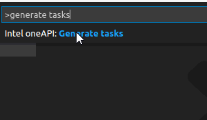
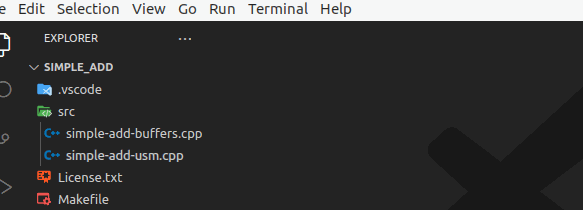
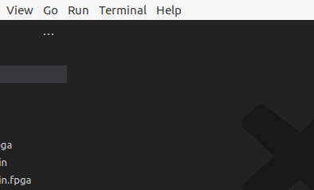
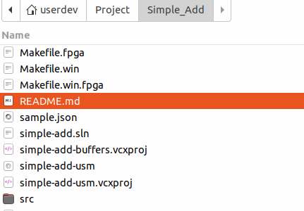

# Analysis Configurator for Intel Software Developer Tools

#### [Repository](https://github.com/intel/vscode-oneapi-analysis-configurator)&nbsp;&nbsp;|&nbsp;&nbsp;[Issues](https://github.com/intel/vscode-oneapi-analysis-configurator/issues)&nbsp;&nbsp;|&nbsp;&nbsp;[Documentation](https://www.intel.com/content/www/us/en/developer/tools/oneapi/documentation.html)&nbsp;&nbsp;|&nbsp;&nbsp;[Samples](https://github.com/oneapi-src/oneAPI-samples)&nbsp;&nbsp;|&nbsp;&nbsp;[Forums](https://community.intel.com/t5/Intel-oneAPI-Toolkits/ct-p/oneapi)

This extension provides integration of your project with the Intel® VTune™
Profiler and Intel® Advisor analysis tools. It also makes it easier to
configure your oneAPI C/++ projects for building, running and debugging your
application with Visual Studio Code* (VS Code).

- [Intel® VTune™ Profiler](https://www.intel.com/content/www/us/en/developer/tools/oneapi/vtune-profiler.html)
  is a performance profiling tool that provides advanced sampling and profiling
  techniques to quickly analyze code, isolate issues and deliver insights for
  optimizing performance on modern processors.

- [Intel® Advisor](https://www.intel.com/content/www/us/en/develop/documentation/get-started-with-advisor/top.html)
  is for software architects and developers who need the right information and
  recommendations to make the best design and optimization decisions for
  efficient vectorization,   threading, and offloading to accelerators.

For details on which compiler options to use with the Intel® VTune™ Profiler,
see the [Setup Analysis Target](https://www.intel.com/content/www/us/en/develop/documentation/vtune-help/top/set-up-analysis-target.html)
section of the [Intel® VTune™ Profiler User Guide](https://www.intel.com/content/www/us/en/develop/documentation/vtune-help/top.html).

For details on which compiler options to use with the Intel® Advisor, see the
[Build Target Application](https://www.intel.com/content/www/us/en/develop/documentation/advisor-user-guide/top/set-up-project/build-target.html)
section of the [Intel® Advisor User Guide](https://www.intel.com/content/www/us/en/develop/documentation/advisor-user-guide/top.html).

## Where to find Intel oneAPI toolkits

This extension does not provide any of the tools that are required to perform
profiling or analysis.

Please visit https://www.intel.com/oneapi for details. For more
information on how to use Visual Studio Code with Intel oneAPI toolkits,
please visit [Using VS Code with Intel oneAPI toolkits](https://www.intel.com/content/www/us/en/develop/documentation/using-vs-code-with-intel-oneapi/top.html).

## Preparing Tasks from Make / CMake Files
1. Using the VS Code explorer, click `File -> Open Folder`.
2. Navigate to the folder where your project is located and click `OK`.
    (In our case it is oneAPI sample "Simple Add")
3. Press `Ctrl+Shift+P ( or View -> Command Palette... )` to open the
    Command Palette.
4. Type **Intel oneAPI** and select `Intel oneAPI: Generate tasks`.

    

5. Follow the prompts to add targets from your make/cmake oneAPI project.

    

6. Run the target by selecting `Terminal > Run task...` or by
    `Tasks: Run Task` from Command Palette.
7. Select the task to run.

    

## Building a single cpp file:
1. Open the cpp file you want to build.
2. Press `Ctrl+Shift+P` ( or `View -> Command Palette...` ) to open the
   Command Palette.
3. Type **Intel oneAPI** and select
   `Intel oneAPI: Quick build current file with ICPX`.
4. If you want to build a file with SYCL enabled, choose the option
   `Intel oneAPI: Quick build current file with ICPX and SYCL enabled`.

    

## Using Intel analysis tools
You need to have at least one of the above Intel analysis tools installed for
this extension to work and be useful.
1. Open a Visual Studio Code project.
2. Build your project to create the executable you plan to analyze (run proper
   task from previous steps).
3. Press `Ctrl+Shift+P` ( or `View -> Command Palette...` ) to open the
   Command Palette in VS Code.
4. Type **Intel oneAPI** and select `Intel oneAPI:Launch Advisor` or
   `Intel oneAPI: Launch VTune Profiler`.
5. Select the executable you want to analyze. This needs to be done once for a
   workspace unless you want to analyze a different executable.

    

6. Select the installation path of the tool * Intel Advisor or Intel VTune
   Profiler. This needs to be done once for a workspace.

    

7. Enter the name of the tool`s project folder, or press enter to accept the
   default. This needs to be done once for a workspace.
8. The extension will open the Intel VTune Profiler and pass the appropriate project
   parameters to the tool.

    

## How to Use IntelliSense for Code Developed with Intel oneAPI Toolkits

### Configure C++ Properties

This extension provides the ability to configure the cpp properties
includePath, defines, and compilerPath.
 1. Press `Ctrl+Shift+P` ( or `View -> Command Palette...` ) to open the
    Command Palette in VS Code.
 2. Type `Intel oneAPI: configure cpp properties configuration` and select it
    from the palette.
 3. Select cpp standard.
 4. Select c standard.
 5. A message will appear in the lower right corner to confirm the properties
    have been configured.

    

To view or change the properties, open settings.json from the VS Code Explorer.

To make changes to the configuration, edit the default path in settings.json.

## IntelliSense for basic code hints for FPGA Memory Attributes and CPU pragmas
- While typing some of the Attributes/Pragmas, there will be suggestions with
  a description of what function should you use.
- The description with the common usage will be visible when hovering a cursor
  over a Attribute or Pragma in your code.

FPGA Loop Directives, FPGA Memory Attributes, FPGA Kernel Attributes and CPU
pragmas are supported.
[Learn more about FPGA Attributes](https://www.intel.com/content/www/us/en/develop/documentation/oneapi-fpga-optimization-guide/top/quick-reference.html)
[Learn more about CPU pragmas](https://www.intel.com/content/www/us/en/develop/documentation/oneapi-dpcpp-cpp-compiler-dev-guide-and-reference/top/compiler-reference/pragmas/intel-specific-pragma-reference.html)

## Contributing
Install Visual Studio Code (at least version 1.42) and open this project within
it. You also need `node + npm`.
- Switch to project root folder
- `npm install`
- `code .`

At this point you should be able to run the extension in the
"Extension Development Host".

## License
This extension is released under the MIT License.

*Other names and brands may be claimed as the property of others.

